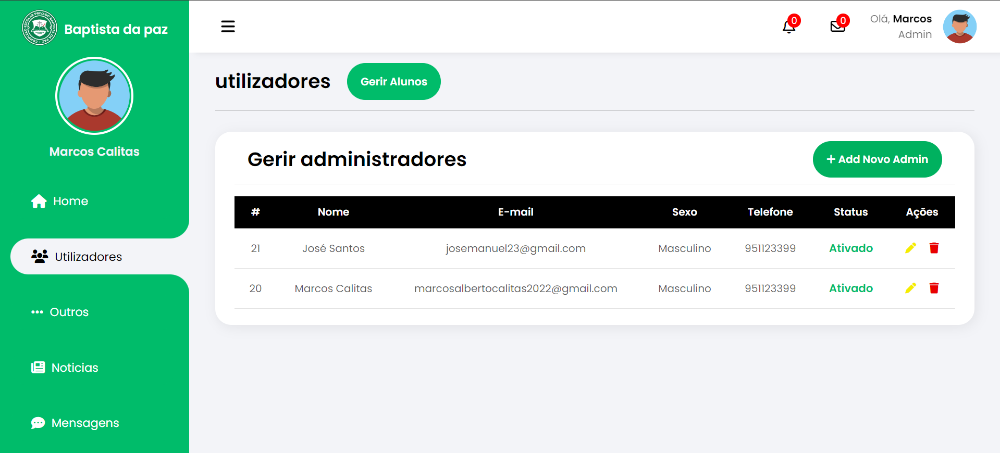

# Cobapaz

- [Cobapaz](#cobapaz)
  - [Overview](#overview)
  - [Demo](#demo)
  - [Features](#features)
    - [Institutional Website](#institutional-website)
    - [Login System](#login-system)
    - [Registration System](#registration-system)
    - [Account Recovery System](#account-recovery-system)
    - [Student Dashboard](#student-dashboard)
    - [Admin Dashboard](#admin-dashboard)
  - [Technologies](#technologies)
  - [Requirements](#requirements)

## Overview
**Cobapaz** is a **Payment by Reference System** designed to simplify the management of tuition fees at a private educational institution. The system enables students to generate payment references, while the administration can monitor the status of these transactions through an intuitive administrative dashboard.

## Demo
You can view the project demo running [by clicking here](https://youtu.be/aHl0_Pbi4S4).

## Features

### Institutional Website
- **Home Page:** The landing page of the system that provides an overview and quick access to key functionalities.
  
  
  
  
  

- **Courses Page:** A dedicated page listing all courses offered by the institution, allowing students to explore available options.

  

- **Contact Page:** Provides contact information for the institution, facilitating communication between students and administration.

  

- **Footer:** The system's footer that includes important links and information about the institution.

  

### Login System
- **Login Form:** The interface that allows students to authenticate into the system using their credentials.

  
  

### Registration System
- **Registration Form:** Used to register new students, gathering the necessary information for account creation.

  
  
  

- **Email Verification Form:** This form verifies if the provided email belongs to the student, ensuring the authenticity of the registration.

  

- **Verification Code Form:** Used to validate the OTP (One-Time Password) sent to the student's email, confirming their identity.

  

- **Success Page:** Displays a message confirming that the account has been successfully created.

  

### Account Recovery System
- **Account Recovery Form:** Allows students to initiate the process of recovering their accounts in case they forget their password.

  

- **Reset Password Form:** An interface where students can set a new password after recovering their account.

  

### Student Dashboard
- **Edit Profile:** The student panel where users can update personal information and adjust account settings.

  

- **Edit Image:** A modal that allows students to update their profile picture.

  

- **Payments Dashboard:** A dedicated area for students to make their tuition payments quickly and securely.

  

- **Payments Table:** Displays a history of the payments made by the student, allowing them to track their financial activities.

  

### Admin Dashboard
- **Admin Dashboard:** A comprehensive panel that provides analytics and metrics for managing the institution.

  
  

- **Course Management:** A tool for the admin to add, edit, or remove courses offered by the institution.

  

- **Student Management:** An interface that allows the admin to view and manage student information.

  

- **Admin Management:** Allows the admin to add or remove other administrators from the system.

  

## Technologies

- **Front-end:**
  - HTML5
  - CSS3
  - JavaScript
  - jQuery (AJAX)

 
  
  
  
  

- **Back-end:**
  - PHP 8.x
  - SQL
  - MySQL

 
  
  

- **Other Technologies:**
  - **PHPMailer:** Used for sending automated emails.
  - **League/Plates:** Utilized for creating the templating system.
  - **Composer:** A tool for managing project dependencies.
  - **.htaccess:** Configuration file for managing friendly URLs.

## Requirements

- PHP 8.x
- MySQL 8.x
- Composer 2.x
